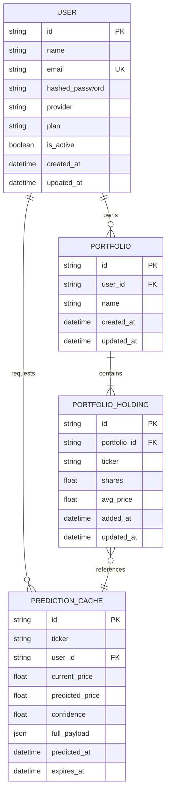
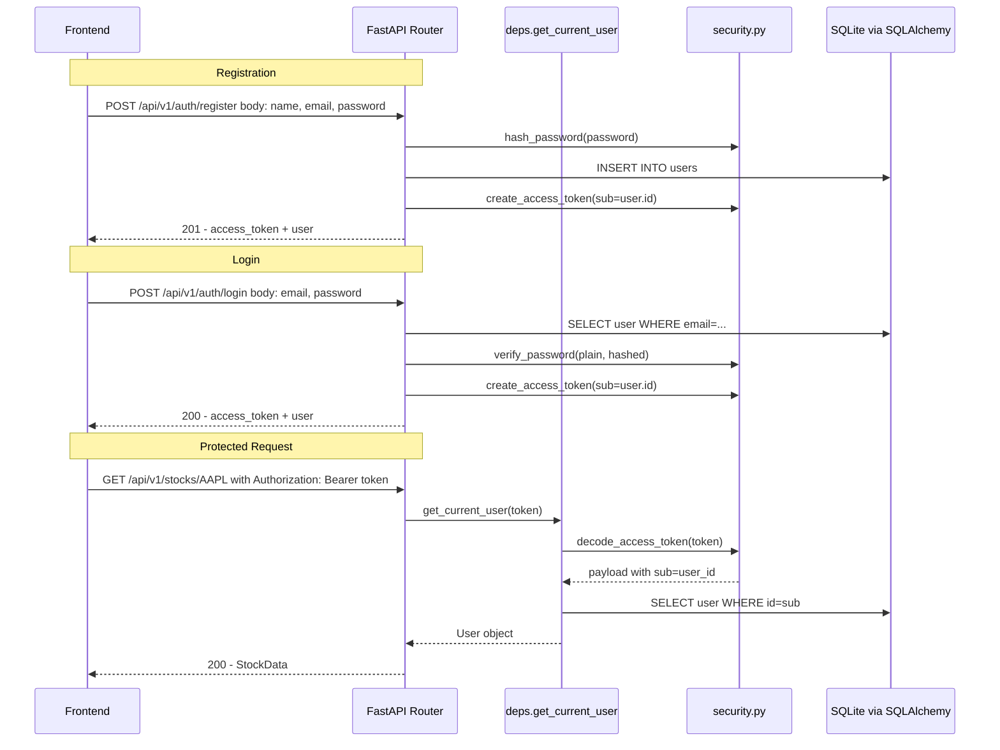
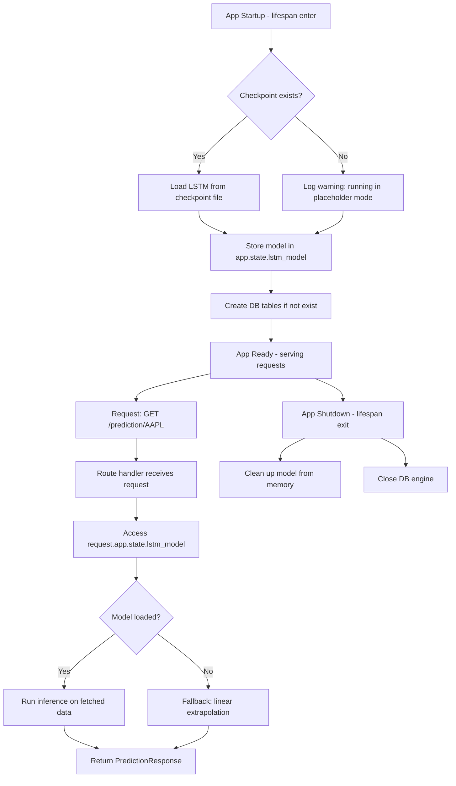
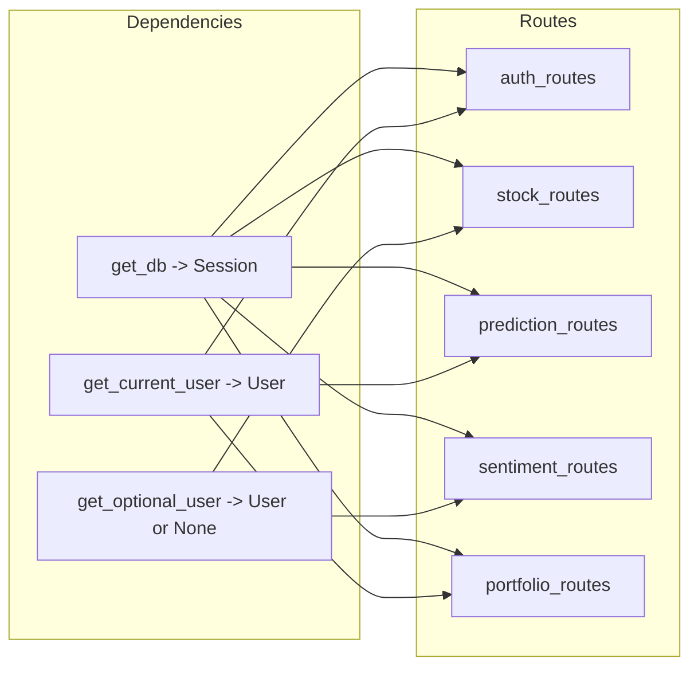
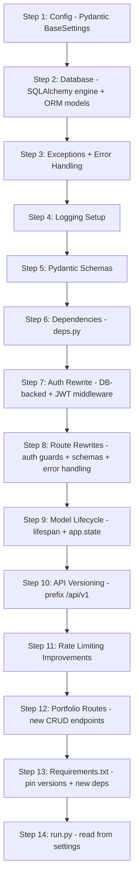

# AI-QUITY Backend Architecture — Fix Plan

> **Status**: Design document for code-mode implementation  
> **Scope**: FastAPI backend hardening — database, auth, config, error handling, logging, schemas, model lifecycle, API versioning, rate limiting, dependency injection  
> **Baseline**: Current code reviewed 2026-03-06

---

## Table of Contents

1. [File Structure](#1-file-structure)
2. [Database Schema](#2-database-schema)
3. [Config Pattern](#3-config-pattern)
4. [Auth Flow](#4-auth-flow)
5. [Error Handling Pattern](#5-error-handling-pattern)
6. [Logging Pattern](#6-logging-pattern)
7. [Pydantic Schemas](#7-pydantic-schemas)
8. [Model Lifecycle](#8-model-lifecycle)
9. [API Versioning](#9-api-versioning)
10. [Rate Limiting](#10-rate-limiting)
11. [Dependency Injection](#11-dependency-injection)
12. [Implementation Order](#12-implementation-order)
13. [Migration Checklist](#13-migration-checklist)

---

## 1. File Structure

### Current vs Proposed

```
backend/
├── .env                              # ✅ Keep (already well-structured)
├── .env.example                      # 🆕 Committed template without secrets
├── requirements.txt                  # ✏️  Pin versions
├── run.py                            # ✏️  Read host/port from settings
├── alembic.ini                       # 🆕 Alembic config
├── alembic/                          # 🆕 Migration scripts
│   ├── env.py
│   ├── script.py.mako
│   └── versions/
│       └── 001_initial_schema.py
├── app/
│   ├── __init__.py                   # 🆕 Package marker
│   ├── config.py                     # ✏️  Pydantic BaseSettings rewrite
│   ├── database.py                   # ✏️  SQLAlchemy engine + session factory
│   ├── main.py                       # ✏️  Lifespan, global error handler, versioned routers
│   ├── exceptions.py                 # 🆕 Custom exception classes
│   ├── logging_config.py             # 🆕 Structured logging setup
│   │
│   ├── db_models/                    # 🆕 SQLAlchemy ORM models (renamed from models/)
│   │   ├── __init__.py
│   │   ├── base.py                   # 🆕 Declarative base + mixins
│   │   ├── user.py                   # 🆕 User model
│   │   ├── portfolio.py              # 🆕 Portfolio + PortfolioHolding models
│   │   └── prediction_cache.py       # 🆕 PredictionCache model
│   │
│   ├── ml_models/                    # ✏️  Renamed from models/ to avoid collision
│   │   ├── __init__.py
│   │   ├── lstm_model.py             # ✏️  Load from checkpoint, no dummy training
│   │   └── transformer_model.py      # ✏️  Lazy-load behind feature flag
│   │
│   ├── schemas/                      # 🆕 Pydantic request/response schemas
│   │   ├── __init__.py
│   │   ├── auth.py                   # 🆕 RegisterRequest, LoginRequest, TokenResponse, UserResponse
│   │   ├── stock.py                  # 🆕 StockResponse, CandleData
│   │   ├── prediction.py             # 🆕 PredictionResponse
│   │   ├── sentiment.py              # 🆕 SentimentResponse, NewsArticle
│   │   ├── portfolio.py              # 🆕 PortfolioResponse, HoldingCreate, HoldingUpdate
│   │   └── common.py                 # 🆕 ErrorResponse, HealthResponse, PaginatedResponse
│   │
│   ├── routes/                       # ✏️  All routes rewritten with auth guards + schemas
│   │   ├── __init__.py               # 🆕 Aggregate router
│   │   ├── auth_routes.py            # ✏️  DB-backed, proper JWT flow
│   │   ├── prediction_routes.py      # ✏️  Add auth, input validation, error handling
│   │   ├── sentiment_routes.py       # ✏️  Add auth, input validation, error handling
│   │   ├── stock_routes.py           # ✏️  Add auth, input validation, error handling
│   │   └── portfolio_routes.py       # 🆕 CRUD for user portfolios
│   │
│   ├── services/                     # ✏️  Add error handling + logging throughout
│   │   ├── __init__.py
│   │   ├── data_collector.py         # ✏️  Add caching, error handling
│   │   ├── portfolio_optimizer.py    # ✏️  Replace naive equal-weight
│   │   ├── prediction_model.py       # ✏️  Remove global state, use app.state
│   │   ├── preprocessing.py          # ✏️  Add sequence creation, NaN handling
│   │   └── sentiment_analysis.py     # ✏️  Add error handling, real News API support
│   │
│   ├── utils/
│   │   ├── __init__.py
│   │   ├── helpers.py                # ✏️  Actual utility functions
│   │   ├── indicators.py             # ✏️  Already covered in data_collector, reconcile
│   │   └── security.py               # ✏️  Wire get_current_user into DI, add refresh tokens
│   │
│   └── deps.py                       # 🆕 FastAPI dependency functions (get_db, get_current_user, etc.)
│
└── tests/                            # 🆕 Test suite
    ├── __init__.py
    ├── conftest.py                   # 🆕 Fixtures (test client, test DB)
    ├── test_auth.py
    ├── test_stocks.py
    ├── test_predictions.py
    └── test_sentiment.py
```

### Key Rename: `models/` → `db_models/` + `ml_models/`

The current [`models/`](backend/app/models/) directory contains ML model definitions. We split it:
- **`db_models/`** — SQLAlchemy ORM models for the database
- **`ml_models/`** — LSTM, Transformer, and future ML model definitions

This eliminates the naming collision between "database models" and "machine learning models".

---

## 2. Database Schema

### Engine + Session Setup

**File**: [`app/database.py`](backend/app/database.py)

Replace the stub with a real SQLAlchemy async-compatible setup:

```python
from sqlalchemy import create_engine
from sqlalchemy.orm import sessionmaker, Session
from app.config import settings

engine = create_engine(
    settings.DATABASE_URL,
    connect_args={"check_same_thread": False}  # SQLite only
    if settings.DATABASE_URL.startswith("sqlite")
    else {},
    echo=settings.DEBUG,
    pool_pre_ping=True,
)

SessionLocal = sessionmaker(
    autocommit=False,
    autoflush=False,
    bind=engine,
)

def get_db() -> Session:
    """Dependency — yields a DB session, auto-closes after request."""
    db = SessionLocal()
    try:
        yield db
    finally:
        db.close()
```

### Declarative Base + Mixins

**File**: `app/db_models/base.py`

```python
import uuid
from datetime import datetime
from sqlalchemy import Column, DateTime, String
from sqlalchemy.orm import DeclarativeBase

class Base(DeclarativeBase):
    pass

class TimestampMixin:
    """Adds created_at and updated_at columns."""
    created_at = Column(DateTime, default=datetime.utcnow, nullable=False)
    updated_at = Column(DateTime, default=datetime.utcnow, onupdate=datetime.utcnow, nullable=False)

class UUIDMixin:
    """Adds a UUID primary key column."""
    id = Column(String(36), primary_key=True, default=lambda: str(uuid.uuid4()))
```

### Entity-Relationship Diagram



### Model Definitions

#### `app/db_models/user.py` — User

```python
from sqlalchemy import Column, String, Boolean
from sqlalchemy.orm import relationship
from app.db_models.base import Base, TimestampMixin, UUIDMixin

class User(Base, UUIDMixin, TimestampMixin):
    __tablename__ = "users"

    name = Column(String(100), nullable=False)
    email = Column(String(255), unique=True, nullable=False, index=True)
    hashed_password = Column(String(255), nullable=True)   # nullable for OAuth users
    provider = Column(String(20), nullable=False, default="email")  # email | google | github
    plan = Column(String(20), nullable=False, default="Free")       # Free | Pro | Enterprise
    is_active = Column(Boolean, default=True, nullable=False)

    # Relationships
    portfolios = relationship("Portfolio", back_populates="owner", cascade="all, delete-orphan")
    prediction_caches = relationship("PredictionCache", back_populates="user", cascade="all, delete-orphan")
```

#### `app/db_models/portfolio.py` — Portfolio + PortfolioHolding

```python
from sqlalchemy import Column, String, Float, ForeignKey, DateTime
from sqlalchemy.orm import relationship
from app.db_models.base import Base, TimestampMixin, UUIDMixin

class Portfolio(Base, UUIDMixin, TimestampMixin):
    __tablename__ = "portfolios"

    user_id = Column(String(36), ForeignKey("users.id", ondelete="CASCADE"), nullable=False, index=True)
    name = Column(String(100), nullable=False, default="Default Portfolio")

    owner = relationship("User", back_populates="portfolios")
    holdings = relationship("PortfolioHolding", back_populates="portfolio", cascade="all, delete-orphan")


class PortfolioHolding(Base, UUIDMixin, TimestampMixin):
    __tablename__ = "portfolio_holdings"

    portfolio_id = Column(String(36), ForeignKey("portfolios.id", ondelete="CASCADE"), nullable=False, index=True)
    ticker = Column(String(20), nullable=False)
    shares = Column(Float, nullable=False)
    avg_price = Column(Float, nullable=False)

    portfolio = relationship("Portfolio", back_populates="holdings")
```

#### `app/db_models/prediction_cache.py` — PredictionCache

```python
from sqlalchemy import Column, String, Float, DateTime, JSON, ForeignKey
from sqlalchemy.orm import relationship
from datetime import datetime, timedelta
from app.db_models.base import Base, UUIDMixin

class PredictionCache(Base, UUIDMixin):
    __tablename__ = "prediction_cache"

    ticker = Column(String(20), nullable=False, index=True)
    user_id = Column(String(36), ForeignKey("users.id", ondelete="SET NULL"), nullable=True)
    current_price = Column(Float, nullable=False)
    predicted_price = Column(Float, nullable=False)
    confidence = Column(Float, nullable=False)
    full_payload = Column(JSON, nullable=False)      # Store the complete PredictionData dict
    predicted_at = Column(DateTime, default=datetime.utcnow, nullable=False)
    expires_at = Column(DateTime, nullable=False,
                        default=lambda: datetime.utcnow() + timedelta(minutes=15))

    user = relationship("User", back_populates="prediction_caches")
```

### Migration Strategy

Use **Alembic** for schema migrations:

1. `alembic init alembic` — create migration folder
2. Point `alembic.ini` `sqlalchemy.url` to `settings.DATABASE_URL`
3. In `alembic/env.py` import `Base.metadata` from `app.db_models.base`
4. First migration: `alembic revision --autogenerate -m "initial_schema"`
5. Apply: `alembic upgrade head`

For local dev, also add a `create_all` call in the lifespan event for convenience so the DB is auto-created on first run without requiring Alembic.

---

## 3. Config Pattern

### Current Problem

[`app/config.py`](backend/app/config.py) uses `os.getenv()` with manual type casting — no validation, no type safety, no `.env` auto-loading via Pydantic.

### New Design

**File**: [`app/config.py`](backend/app/config.py) — full rewrite

```python
from pydantic_settings import BaseSettings
from pydantic import Field, field_validator
from typing import List

class Settings(BaseSettings):
    # ── App ──
    PROJECT_NAME: str = "AI Stock Prediction Backend"
    VERSION: str = "1.0"
    DEBUG: bool = False

    # ── Server ──
    HOST: str = "0.0.0.0"
    PORT: int = 8000

    # ── CORS ──
    ALLOWED_ORIGINS: List[str] = ["http://localhost:5173", "http://localhost:3000"]

    @field_validator("ALLOWED_ORIGINS", mode="before")
    @classmethod
    def parse_origins(cls, v):
        if isinstance(v, str):
            return [origin.strip() for origin in v.split(",")]
        return v

    # ── Security / JWT ──
    SECRET_KEY: str = Field(default="change_me_to_a_long_random_secret_key", min_length=16)
    ALGORITHM: str = "HS256"
    ACCESS_TOKEN_EXPIRE_MINUTES: int = 60

    # ── Database ──
    DATABASE_URL: str = "sqlite:///./aiquity.db"

    # ── ML ──
    MODEL_CHECKPOINT_PATH: str = "models/lstm_checkpoint.h5"
    LSTM_LOOKBACK: int = 60
    TRAINING_PERIOD: str = "5y"

    # ── Cache ──
    CACHE_BACKEND: str = "memory"        # memory | redis
    REDIS_URL: str = "redis://localhost:6379/0"
    STOCK_CACHE_TTL: int = 300           # seconds

    # ── External APIs ──
    ALPHA_VANTAGE_API_KEY: str = ""
    NEWS_API_KEY: str = ""

    # ── Logging ──
    LOG_LEVEL: str = "INFO"

    # ── Rate Limiting ──
    RATE_LIMIT_PER_MINUTE: int = 60

    model_config = {
        "env_file": ".env",
        "env_file_encoding": "utf-8",
        "case_sensitive": True,
        "extra": "ignore",
    }

settings = Settings()
```

### Key Changes

| Aspect | Before | After |
|--------|--------|-------|
| Base class | Plain `class Settings` | `pydantic_settings.BaseSettings` |
| Type coercion | Manual `int(os.getenv(...))` | Automatic via field types |
| Validation | None | `Field(min_length=16)` on SECRET_KEY, `field_validator` on ALLOWED_ORIGINS |
| `.env` loading | `python-dotenv` manual call | Built into `model_config` |
| Dependency | `python-dotenv` | `pydantic-settings` (add to requirements.txt) |

### New Dependency

Add to [`requirements.txt`](backend/requirements.txt):

```
pydantic-settings>=2.0.0
sqlalchemy>=2.0.0
alembic>=1.13.0
```

---

## 4. Auth Flow

### Current Problem

[`security.py`](backend/app/utils/security.py) has `get_current_user()` and `get_optional_user()` dependency functions, but they are **never injected** into any route. [`auth_routes.py`](backend/app/routes/auth_routes.py) uses an in-memory `_users: dict` store instead of a database.

### Design



### Token Structure (JWT Payload)

```json
{
  "sub": "user-uuid-here",
  "name": "Ronak",
  "email": "ronak@example.com",
  "exp": 1709712000
}
```

- `sub` — User UUID (not email, for security)
- `exp` — Expiry timestamp
- Algorithm: HS256

### Password Hashing

Already implemented in [`security.py`](backend/app/utils/security.py:17) using `passlib[bcrypt]`. No changes needed:

```python
pwd_context = CryptContext(schemes=["bcrypt"], deprecated="auto")
```

### Updated `security.py` Design

```python
# app/utils/security.py — keep existing functions, update get_current_user

from sqlalchemy.orm import Session
from app.db_models.user import User

async def get_current_user(
    token: str = Depends(oauth2_scheme),
    db: Session = Depends(get_db),
) -> User:
    """Decode JWT, look up user in DB, return User ORM object."""
    if token is None:
        raise HTTPException(status_code=401, detail="Not authenticated")
    payload = decode_access_token(token)
    user_id: str = payload.get("sub")
    if user_id is None:
        raise HTTPException(status_code=401, detail="Invalid token payload")
    user = db.query(User).filter(User.id == user_id, User.is_active == True).first()
    if user is None:
        raise HTTPException(status_code=401, detail="User not found or deactivated")
    return user

async def get_optional_user(
    token: str = Depends(oauth2_scheme),
    db: Session = Depends(get_db),
) -> User | None:
    """Returns User or None — for public endpoints that benefit from auth context."""
    if token is None:
        return None
    try:
        return await get_current_user(token=token, db=db)
    except HTTPException:
        return None
```

### Route Protection Tiers

| Tier | Dependency | Routes |
|------|-----------|--------|
| **Public** | No auth | `GET /health`, `POST /auth/login`, `POST /auth/register` |
| **Optional auth** | `get_optional_user` | `GET /stocks/{symbol}`, `GET /sentiment/{symbol}` |
| **Required auth** | `get_current_user` | `GET /prediction/{symbol}`, all `/portfolio/*` routes |

### Auth Routes Rewrite Summary

[`auth_routes.py`](backend/app/routes/auth_routes.py) changes:
- Replace `_users: dict` with `db.query(User)` calls
- Register: hash password → INSERT User → create token → return
- Login: SELECT by email → verify password → create token → return
- OAuth: Upsert user by email+provider → create token → return
- Add `GET /auth/me` endpoint returning the current user profile (uses `get_current_user`)

---

## 5. Error Handling Pattern

### Current Problem

Routes catch `Exception` generically and return `HTTPException(500, str(exc))` — exposes internal error messages and stack traces. No structured error format.

### Custom Exception Classes

**File**: `app/exceptions.py` (new)

```python
from fastapi import HTTPException, status

class AppException(HTTPException):
    """Base exception for all application errors."""
    def __init__(self, status_code: int, detail: str, error_code: str = "UNKNOWN_ERROR"):
        super().__init__(status_code=status_code, detail=detail)
        self.error_code = error_code

class NotFoundException(AppException):
    def __init__(self, resource: str, identifier: str):
        super().__init__(
            status_code=status.HTTP_404_NOT_FOUND,
            detail=f"{resource} '{identifier}' not found",
            error_code="NOT_FOUND",
        )

class AuthenticationError(AppException):
    def __init__(self, detail: str = "Invalid credentials"):
        super().__init__(
            status_code=status.HTTP_401_UNAUTHORIZED,
            detail=detail,
            error_code="AUTH_ERROR",
        )

class AuthorizationError(AppException):
    def __init__(self, detail: str = "Insufficient permissions"):
        super().__init__(
            status_code=status.HTTP_403_FORBIDDEN,
            detail=detail,
            error_code="FORBIDDEN",
        )

class ValidationError(AppException):
    def __init__(self, detail: str):
        super().__init__(
            status_code=status.HTTP_422_UNPROCESSABLE_ENTITY,
            detail=detail,
            error_code="VALIDATION_ERROR",
        )

class ExternalServiceError(AppException):
    def __init__(self, service: str, detail: str = "External service unavailable"):
        super().__init__(
            status_code=status.HTTP_502_BAD_GATEWAY,
            detail=f"{service}: {detail}",
            error_code="EXTERNAL_SERVICE_ERROR",
        )

class RateLimitError(AppException):
    def __init__(self):
        super().__init__(
            status_code=status.HTTP_429_TOO_MANY_REQUESTS,
            detail="Rate limit exceeded. Try again later.",
            error_code="RATE_LIMITED",
        )
```

### Structured Error Response Schema

All error responses follow a single format (defined in `app/schemas/common.py`):

```python
class ErrorResponse(BaseModel):
    error_code: str          # Machine-readable code, e.g. "NOT_FOUND"
    detail: str              # Human-readable message
    timestamp: str           # ISO 8601 UTC
```

Example response:
```json
{
  "error_code": "NOT_FOUND",
  "detail": "Stock 'INVALID' not found",
  "timestamp": "2026-03-06T07:30:00Z"
}
```

### Global Exception Handler

Register in [`main.py`](backend/app/main.py):

```python
from fastapi import Request
from fastapi.responses import JSONResponse
from datetime import datetime, timezone
from app.exceptions import AppException

@app.exception_handler(AppException)
async def app_exception_handler(request: Request, exc: AppException) -> JSONResponse:
    logger.warning(f"AppException: {exc.error_code} - {exc.detail} - {request.url}")
    return JSONResponse(
        status_code=exc.status_code,
        content={
            "error_code": exc.error_code,
            "detail": exc.detail,
            "timestamp": datetime.now(timezone.utc).isoformat(),
        },
    )

@app.exception_handler(Exception)
async def unhandled_exception_handler(request: Request, exc: Exception) -> JSONResponse:
    logger.error(f"Unhandled exception: {exc}", exc_info=True)
    return JSONResponse(
        status_code=500,
        content={
            "error_code": "INTERNAL_ERROR",
            "detail": "An unexpected error occurred" if not settings.DEBUG else str(exc),
            "timestamp": datetime.now(timezone.utc).isoformat(),
        },
    )
```

### Route Error Handling Pattern

Every route should use specific exception types, not catch-all:

```python
# Example: prediction_routes.py
@router.get("/{symbol}", response_model=PredictionResponse)
def predict(symbol: str, user: User = Depends(get_current_user)):
    try:
        return predict_stock_price(symbol.upper())
    except ValueError as exc:
        raise NotFoundException("Stock", symbol)
    except RuntimeError as exc:
        raise ExternalServiceError("yfinance", str(exc))
    # Let unhandled errors fall through to global handler
```

---

## 6. Logging Pattern

### Current Problem

[`main.py`](backend/app/main.py:18) has `logging.basicConfig()` but no structured format, no request logging, and no logging calls anywhere else in the codebase.

### Logger Setup

**File**: `app/logging_config.py` (new)

```python
import logging
import sys
from app.config import settings

LOG_FORMAT = (
    "%(asctime)s | %(levelname)-8s | %(name)-25s | %(message)s"
)
DATE_FORMAT = "%Y-%m-%d %H:%M:%S"

def setup_logging() -> None:
    """Configure root logger and app logger."""
    level = getattr(logging, settings.LOG_LEVEL.upper(), logging.INFO)

    # Root logger
    logging.basicConfig(
        level=level,
        format=LOG_FORMAT,
        datefmt=DATE_FORMAT,
        handlers=[logging.StreamHandler(sys.stdout)],
    )

    # Silence noisy third-party loggers
    logging.getLogger("uvicorn.access").setLevel(logging.WARNING)
    logging.getLogger("sqlalchemy.engine").setLevel(
        logging.INFO if settings.DEBUG else logging.WARNING
    )
    logging.getLogger("yfinance").setLevel(logging.WARNING)
    logging.getLogger("tensorflow").setLevel(logging.ERROR)
    logging.getLogger("httpx").setLevel(logging.WARNING)

def get_logger(name: str) -> logging.Logger:
    """Return a named logger. Use module __name__ as convention."""
    return logging.getLogger(f"aiquity.{name}")
```

### Where to Log

| Location | What to Log | Level |
|----------|------------|-------|
| `main.py` lifespan | App startup / shutdown, model load status | `INFO` |
| `main.py` request middleware | Method, path, status, duration_ms | `INFO` |
| `auth_routes.py` | Login success/failure (no passwords), registration | `INFO` / `WARNING` |
| `stock_routes.py` | Symbol requested, cache hit/miss | `INFO` |
| `prediction_routes.py` | Symbol, prediction result summary | `INFO` |
| `sentiment_routes.py` | Symbol, sentiment result | `INFO` |
| `data_collector.py` | yfinance fetch start/end, errors | `INFO` / `ERROR` |
| `prediction_model.py` | Model load, inference time | `INFO` |
| `database.py` | Connection issues | `ERROR` |
| Global exception handler | Full stack trace for unhandled errors | `ERROR` |

### Request Logging Middleware

Add to [`main.py`](backend/app/main.py) as a middleware:

```python
import time

class RequestLoggingMiddleware(BaseHTTPMiddleware):
    async def dispatch(self, request: Request, call_next):
        start = time.perf_counter()
        response = await call_next(request)
        duration_ms = (time.perf_counter() - start) * 1000
        logger.info(
            f"{request.method} {request.url.path} "
            f"status={response.status_code} "
            f"duration={duration_ms:.1f}ms"
        )
        return response
```

### Logger Usage Convention

Every module creates its own logger:

```python
# At the top of each file
from app.logging_config import get_logger
logger = get_logger(__name__)

# Usage
logger.info(f"Fetching stock data for {symbol}")
logger.error(f"yfinance error for {symbol}: {exc}", exc_info=True)
```

---

## 7. Pydantic Schemas

All schemas align with the frontend [`types/index.ts`](frontend/src/types/index.ts) to ensure API contract compatibility.

### `app/schemas/common.py`

```python
from pydantic import BaseModel
from datetime import datetime

class ErrorResponse(BaseModel):
    error_code: str
    detail: str
    timestamp: str

class HealthResponse(BaseModel):
    status: str             # "ok"
    service: str
    version: str
```

### `app/schemas/auth.py`

```python
from pydantic import BaseModel, EmailStr, Field

class RegisterRequest(BaseModel):
    name: str = Field(..., min_length=1, max_length=100)
    email: EmailStr
    password: str = Field(..., min_length=8, max_length=128)

class LoginRequest(BaseModel):
    email: EmailStr
    password: str

class OAuthRequest(BaseModel):
    provider: str = Field(..., pattern=r"^(google|github)$")
    name: str
    email: EmailStr

class UserResponse(BaseModel):
    id: str
    name: str
    email: str
    plan: str                # Free | Pro | Enterprise
    provider: str            # email | google | github

    model_config = {"from_attributes": True}

class TokenResponse(BaseModel):
    access_token: str
    token_type: str = "bearer"
    user: UserResponse
```

### `app/schemas/stock.py`

```python
from pydantic import BaseModel, Field
from typing import List, Literal

class CandleData(BaseModel):
    date: str
    open: float
    high: float
    low: float
    close: float
    volume: int

class MACDData(BaseModel):
    macd: List[float]
    signal: List[float]
    histogram: List[float]

class BollingerBands(BaseModel):
    upper: List[float]
    middle: List[float]
    lower: List[float]

class StockResponse(BaseModel):
    ticker: str
    name: str
    price: float
    change: float
    changePercent: float
    volume: int
    marketCap: str
    peRatio: float
    high52w: float
    low52w: float
    avgVolume: str
    candleData: List[CandleData]
    rsi: List[float]
    macd: MACDData
    bollingerBands: BollingerBands
    movingAverage: List[float]
    trend: Literal["bullish", "bearish", "neutral"]
```

### `app/schemas/prediction.py`

```python
from pydantic import BaseModel
from typing import List

class Probabilities(BaseModel):
    up: float
    down: float
    stable: float

class HistoricalPredictions(BaseModel):
    dates: List[str]
    actual: List[float]
    predicted: List[float]

class ModelMetrics(BaseModel):
    mlAccuracy: float
    dlAccuracy: float
    rmse: float
    mae: float

class PredictionResponse(BaseModel):
    ticker: str
    currentPrice: float
    predictedPrice: float
    predictedChange: float
    predictedChangePercent: float
    confidence: float
    probabilities: Probabilities
    mlPrediction: float
    dlPrediction: float
    historicalPredictions: HistoricalPredictions
    modelMetrics: ModelMetrics
```

### `app/schemas/sentiment.py`

```python
from pydantic import BaseModel, Field
from typing import List, Literal

class NewsArticle(BaseModel):
    id: str
    headline: str
    source: str
    publishedAt: str
    sentiment: Literal["positive", "negative", "neutral"]
    sentimentScore: float
    url: str
    summary: str

class SentimentDistribution(BaseModel):
    positive: float
    negative: float
    neutral: float

class SentimentHistory(BaseModel):
    dates: List[str]
    scores: List[float]

class KeywordItem(BaseModel):
    word: str
    weight: float
    sentiment: Literal["positive", "negative", "neutral"]

class SentimentResponse(BaseModel):
    ticker: str
    overallSentiment: Literal["positive", "negative", "neutral"]
    sentimentScore: float
    sentimentDistribution: SentimentDistribution
    newsArticles: List[NewsArticle]
    sentimentHistory: SentimentHistory
    keywordCloud: List[KeywordItem]

class AnalyzeTextRequest(BaseModel):
    text: str = Field(..., min_length=1, max_length=5000)
```

### `app/schemas/portfolio.py`

```python
from pydantic import BaseModel, Field
from typing import List

class HoldingCreate(BaseModel):
    ticker: str = Field(..., min_length=1, max_length=20, pattern=r"^[A-Z0-9.]+$")
    shares: float = Field(..., gt=0)
    avg_price: float = Field(..., gt=0)

class HoldingUpdate(BaseModel):
    shares: float | None = Field(None, gt=0)
    avg_price: float | None = Field(None, gt=0)

class HoldingResponse(BaseModel):
    id: str
    ticker: str
    shares: float
    avgPrice: float
    currentPrice: float
    value: float
    pnl: float
    pnlPercent: float

class AllocationItem(BaseModel):
    sector: str
    value: float
    percentage: float

class PerformanceData(BaseModel):
    dates: List[str]
    values: List[float]

class PortfolioResponse(BaseModel):
    id: str
    name: str
    holdings: List[HoldingResponse]
    totalValue: float
    totalCost: float
    totalPnl: float
    totalPnlPercent: float
    allocation: List[AllocationItem]
    performance: PerformanceData

class PortfolioCreate(BaseModel):
    name: str = Field(default="Default Portfolio", max_length=100)
```

---

## 8. Model Lifecycle

### Current Problem

[`prediction_model.py`](backend/app/services/prediction_model.py) calls [`get_stock_data()`](backend/app/services/data_collector.py:91) on every request to build a prediction from scratch. [`lstm_model.py`](backend/app/models/lstm_model.py) trains on random data. There is no checkpoint loading, no caching, and the model is recreated per-call.

### Design: FastAPI Lifespan + `app.state`



### Implementation in `main.py`

```python
from contextlib import asynccontextmanager
from pathlib import Path
from app.config import settings
from app.database import engine
from app.db_models.base import Base

@asynccontextmanager
async def lifespan(app: FastAPI):
    """Startup: load models + create DB. Shutdown: cleanup."""
    logger.info("Starting AI-QUITY backend...")

    # ── Database ──
    Base.metadata.create_all(bind=engine)
    logger.info("Database tables ensured")

    # ── ML Model ──
    checkpoint = Path(settings.MODEL_CHECKPOINT_PATH)
    if checkpoint.exists():
        from app.ml_models.lstm_model import load_model_from_checkpoint
        app.state.lstm_model = load_model_from_checkpoint(str(checkpoint))
        logger.info(f"LSTM model loaded from {checkpoint}")
    else:
        app.state.lstm_model = None
        logger.warning(f"No checkpoint at {checkpoint} — using placeholder predictions")

    yield  # ── App is running ──

    # ── Cleanup ──
    app.state.lstm_model = None
    engine.dispose()
    logger.info("Shutdown complete")

app = FastAPI(
    title=settings.PROJECT_NAME,
    version=settings.VERSION,
    lifespan=lifespan,
    docs_url="/docs" if settings.DEBUG else None,
    redoc_url="/redoc" if settings.DEBUG else None,
)
```

### Accessing Model in Routes

Routes access the model via `request.app.state`:

```python
from fastapi import Request

@router.get("/{symbol}", response_model=PredictionResponse)
def predict(symbol: str, request: Request, user: User = Depends(get_current_user)):
    model = request.app.state.lstm_model  # None if no checkpoint
    return predict_stock_price(symbol.upper(), model=model)
```

### Updated `prediction_model.py` Signature

```python
def predict_stock_price(symbol: str, model=None) -> dict:
    """
    If model is provided (loaded LSTM), use it for inference.
    Otherwise, fall back to linear extrapolation.
    """
    stock = get_stock_data(symbol, "3M")
    prices = [c["close"] for c in stock["candleData"]]

    if model is not None:
        predicted_price = _lstm_predict(model, prices)
    else:
        predicted_price = _simple_predict(prices)

    # ... rest of response building unchanged
```

### Updated `lstm_model.py`

```python
# app/ml_models/lstm_model.py

import os
from tensorflow.keras.models import Sequential, load_model as keras_load
from tensorflow.keras.layers import LSTM, Dense

def create_model(lookback: int = 60) -> Sequential:
    """Define the LSTM architecture — does NOT train it."""
    model = Sequential([
        LSTM(50, return_sequences=True, input_shape=(lookback, 1)),
        LSTM(50),
        Dense(1),
    ])
    model.compile(optimizer="adam", loss="mse")
    return model

def load_model_from_checkpoint(path: str) -> Sequential:
    """Load a trained model from an .h5 checkpoint file."""
    if not os.path.exists(path):
        raise FileNotFoundError(f"Model checkpoint not found: {path}")
    return keras_load(path)
```

**Key change**: Remove the `load_model()` function that trains on random data. The `create_model()` function is kept for training scripts only. The API uses `load_model_from_checkpoint()`.

---

## 9. API Versioning

### Strategy: URL Prefix `/api/v1`

All routes get a `/api/v1` prefix. This is the simplest approach and is compatible with the frontend since it uses a configurable `BASE_URL`.

### Implementation

**File**: `app/routes/__init__.py` (new)

```python
from fastapi import APIRouter
from app.routes.auth_routes import router as auth_router
from app.routes.stock_routes import router as stock_router
from app.routes.prediction_routes import router as prediction_router
from app.routes.sentiment_routes import router as sentiment_router
from app.routes.portfolio_routes import router as portfolio_router

api_v1_router = APIRouter(prefix="/api/v1")

api_v1_router.include_router(auth_router)
api_v1_router.include_router(stock_router)
api_v1_router.include_router(prediction_router)
api_v1_router.include_router(sentiment_router)
api_v1_router.include_router(portfolio_router)
```

**In `main.py`**:

```python
from app.routes import api_v1_router

app.include_router(api_v1_router)
```

### Resulting URL Map

| Method | URL | Auth | Description |
|--------|-----|------|-------------|
| `GET` | `/` | No | Health check (root) |
| `GET` | `/health` | No | Health check |
| `POST` | `/api/v1/auth/register` | No | Register |
| `POST` | `/api/v1/auth/login` | No | Login |
| `POST` | `/api/v1/auth/oauth` | No | OAuth login |
| `GET` | `/api/v1/auth/me` | Yes | Current user profile |
| `GET` | `/api/v1/stocks/{symbol}` | Optional | Stock data + indicators |
| `GET` | `/api/v1/prediction/{symbol}` | Yes | Price prediction |
| `GET` | `/api/v1/sentiment/{symbol}` | Optional | Sentiment analysis |
| `POST` | `/api/v1/sentiment/analyze` | Yes | Analyze custom text |
| `GET` | `/api/v1/portfolio` | Yes | Get user portfolio |
| `POST` | `/api/v1/portfolio` | Yes | Create portfolio |
| `POST` | `/api/v1/portfolio/{id}/holdings` | Yes | Add holding |
| `PUT` | `/api/v1/portfolio/{id}/holdings/{holding_id}` | Yes | Update holding |
| `DELETE` | `/api/v1/portfolio/{id}/holdings/{holding_id}` | Yes | Remove holding |

### Frontend Update Required

Update [`frontend/.env`](frontend/.env) to point to the versioned API:

```
VITE_API_BASE_URL=http://localhost:8000/api/v1
```

And update [`api.ts`](frontend/src/services/api.ts) paths — the `/auth/login` etc. paths stay the same relative to the new BASE_URL, so only the env var needs to change.

---

## 10. Rate Limiting

### Current State

[`main.py`](backend/app/main.py:49-66) has a custom in-memory `RateLimitMiddleware` using a `defaultdict(list)`. It works but has issues:
- No differentiation between authenticated and anonymous users
- Memory leak — `_rate_store` grows unbounded (no cleanup of old IPs)
- Not configurable

### Design: Keep Custom Middleware, Improve It

Since `slowapi` is already in [`requirements.txt`](backend/requirements.txt), we can use it. However, the existing custom middleware approach is simpler for our needs. We improve it:

```python
# In main.py — improved RateLimitMiddleware

import time
from collections import defaultdict
from threading import Lock
from app.config import settings

_rate_lock = Lock()
_rate_store: dict[str, list[float]] = defaultdict(list)

class RateLimitMiddleware(BaseHTTPMiddleware):
    async def dispatch(self, request: Request, call_next):
        # Skip rate limiting for health checks
        if request.url.path in ("/", "/health"):
            return await call_next(request)

        ip = request.client.host if request.client else "unknown"
        now = time.time()
        window_start = now - 60.0  # 1-minute window

        with _rate_lock:
            # Prune old entries
            _rate_store[ip] = [t for t in _rate_store[ip] if t > window_start]
            if len(_rate_store[ip]) >= settings.RATE_LIMIT_PER_MINUTE:
                return JSONResponse(
                    status_code=429,
                    content={
                        "error_code": "RATE_LIMITED",
                        "detail": "Rate limit exceeded. Try again later.",
                        "timestamp": datetime.now(timezone.utc).isoformat(),
                    },
                )
            _rate_store[ip].append(now)

        return await call_next(request)
```

### Configuration

Via [`settings`](backend/app/config.py):
- `RATE_LIMIT_PER_MINUTE: int = 60` — default 60 requests/minute per IP

### Periodic Cleanup

Add a background task in the lifespan to clean stale IP entries every 5 minutes:

```python
import asyncio

async def _cleanup_rate_store():
    while True:
        await asyncio.sleep(300)
        cutoff = time.time() - 120  # Remove entries older than 2 minutes
        with _rate_lock:
            stale_ips = [ip for ip, ts in _rate_store.items() if all(t < cutoff for t in ts)]
            for ip in stale_ips:
                del _rate_store[ip]

# In lifespan startup:
cleanup_task = asyncio.create_task(_cleanup_rate_store())
# In lifespan shutdown:
cleanup_task.cancel()
```

---

## 11. Dependency Injection

### Central Dependencies File

**File**: `app/deps.py` (new)

This file aggregates all FastAPI `Depends()` callables in one place:

```python
from fastapi import Depends
from sqlalchemy.orm import Session
from app.database import get_db as _get_db
from app.utils.security import get_current_user as _get_current_user
from app.utils.security import get_optional_user as _get_optional_user
from app.db_models.user import User

# ── Database session ──
def get_db() -> Session:
    """Yield a SQLAlchemy session, auto-closed after request."""
    yield from _get_db()

# ── Auth dependencies ──
# These are re-exported for convenience; the actual logic lives in security.py
get_current_user = _get_current_user
get_optional_user = _get_optional_user
```

### Dependency Flow Diagram



### Usage Pattern in Routes

```python
# app/routes/stock_routes.py
from fastapi import APIRouter, Depends, Query
from app.deps import get_optional_user
from app.db_models.user import User
from app.schemas.stock import StockResponse

router = APIRouter(prefix="/stocks", tags=["Stocks"])

@router.get("/{symbol}", response_model=StockResponse)
def fetch_stock(
    symbol: str,
    timeframe: str = Query("1M", pattern=r"^(1D|1W|1M|3M|1Y)$"),
    user: User | None = Depends(get_optional_user),
):
    # user is None for anonymous, User object for authenticated
    return get_stock_data(symbol.upper(), timeframe)
```

```python
# app/routes/portfolio_routes.py
from fastapi import APIRouter, Depends
from sqlalchemy.orm import Session
from app.deps import get_db, get_current_user
from app.db_models.user import User

router = APIRouter(prefix="/portfolio", tags=["Portfolio"])

@router.get("", response_model=PortfolioResponse)
def get_portfolio(
    user: User = Depends(get_current_user),
    db: Session = Depends(get_db),
):
    # user is guaranteed to be authenticated
    # db is a live SQLAlchemy session
    ...
```

---

## 12. Implementation Order

This is the recommended order for a code-mode agent to implement the changes. Each step is self-contained and testable.



### Step Details

| Step | Files to Create/Modify | Dependencies |
|------|----------------------|--------------|
| 1 | `app/config.py` | None |
| 2 | `app/database.py`, `app/db_models/base.py`, `app/db_models/user.py`, `app/db_models/portfolio.py`, `app/db_models/prediction_cache.py` | Step 1 |
| 3 | `app/exceptions.py` | None |
| 4 | `app/logging_config.py` | Step 1 |
| 5 | `app/schemas/common.py`, `app/schemas/auth.py`, `app/schemas/stock.py`, `app/schemas/prediction.py`, `app/schemas/sentiment.py`, `app/schemas/portfolio.py` | None |
| 6 | `app/deps.py` | Steps 2, 7 |
| 7 | `app/utils/security.py`, `app/routes/auth_routes.py` | Steps 1-6 |
| 8 | `app/routes/stock_routes.py`, `app/routes/prediction_routes.py`, `app/routes/sentiment_routes.py` | Steps 3, 5, 6 |
| 9 | `app/main.py`, `app/ml_models/lstm_model.py` | Steps 1-4 |
| 10 | `app/routes/__init__.py`, `app/main.py` | Steps 7-8 |
| 11 | `app/main.py` | Step 1 |
| 12 | `app/routes/portfolio_routes.py` | Steps 2, 5, 6 |
| 13 | `requirements.txt` | All |
| 14 | `run.py` | Step 1 |

---

## 13. Migration Checklist

### requirements.txt Updates

```
# Existing — pin minimum versions
fastapi>=0.110.0
uvicorn[standard]>=0.29.0
pydantic[email]>=2.0.0
python-jose[cryptography]>=3.3.0
passlib[bcrypt]>=1.7.4
yfinance>=0.2.38
vaderSentiment>=3.3.2
numpy>=1.26.0
tensorflow>=2.16.0
scikit-learn>=1.4.0
pandas>=2.2.0
slowapi>=0.1.9

# New dependencies
pydantic-settings>=2.0.0
sqlalchemy>=2.0.0
alembic>=1.13.0
python-multipart>=0.0.9
```

### Environment Variable Additions

Add to [`.env`](backend/.env):
```
RATE_LIMIT_PER_MINUTE=60
```

### Frontend Changes Required

Update [`frontend/.env`](frontend/.env):
```
VITE_API_BASE_URL=http://localhost:8000/api/v1
```

### Breaking Changes

| Change | Impact | Mitigation |
|--------|--------|------------|
| URL prefix `/api/v1` added | All frontend API calls | Update `VITE_API_BASE_URL` env var |
| Auth required on `/prediction/{symbol}` | Unauthenticated users get 401 | Frontend already sends Bearer token; mock fallback handles failures |
| OAuth now requires body JSON | Frontend sends query params | Update `oauthLogin()` in `api.ts` to send body |
| Error response format changed | Frontend checks `res.detail` | Compatible — `detail` field preserved |

---

## Key Design Decisions Summary

1. **SQLite for dev, PostgreSQL-ready** — `DATABASE_URL` env var switches between them; SQLAlchemy handles both transparently.
2. **UUID primary keys** — Avoids sequential ID enumeration attacks; compatible with both SQLite and PostgreSQL.
3. **JWT `sub` stores user UUID, not email** — More secure; email can change, UUID cannot.
4. **Rename `models/` to `db_models/` + `ml_models/`** — Eliminates the ambiguity between database models and ML models.
5. **Lifespan events for model loading** — Model loaded once at startup, stored in `app.state`, accessed via `request.app.state` in routes. No global mutable state.
6. **Graceful degradation** — If no LSTM checkpoint exists, the prediction endpoint falls back to linear extrapolation instead of crashing.
7. **Optional auth on public routes** — Stock data and sentiment are accessible without login; predictions and portfolio require authentication.
8. **Structured error responses** — Every error returns `{error_code, detail, timestamp}` for consistent frontend handling.
9. **Custom middleware over slowapi** — Simpler, no extra dependency complexity, sufficient for current scale.
10. **Alembic for migrations** — But also `create_all()` in lifespan for dev convenience so the app works without running migrations first.
